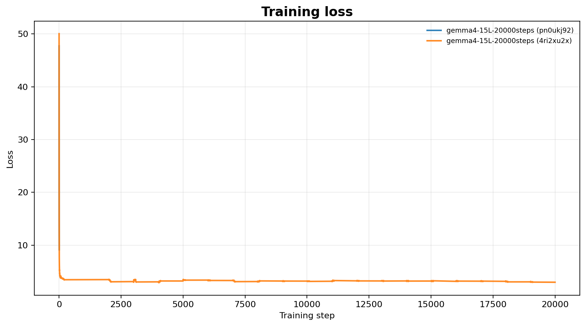
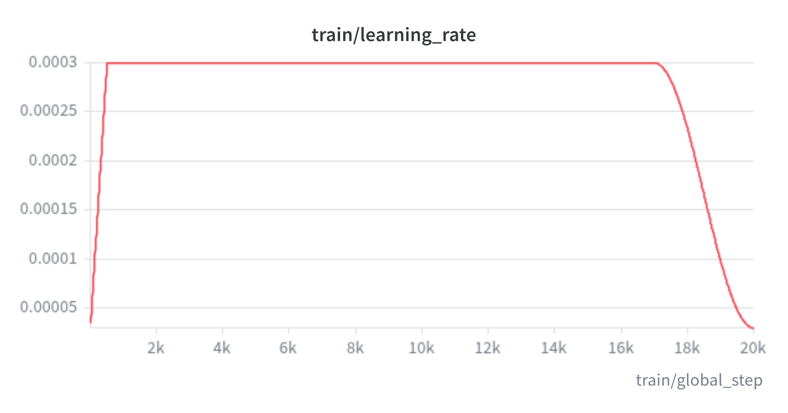
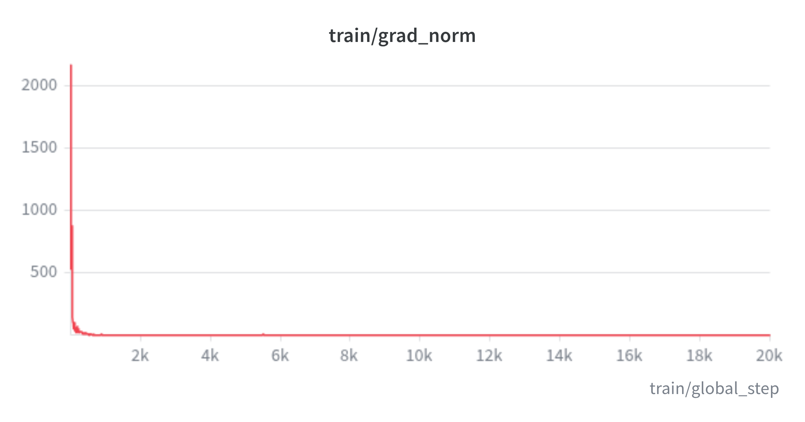
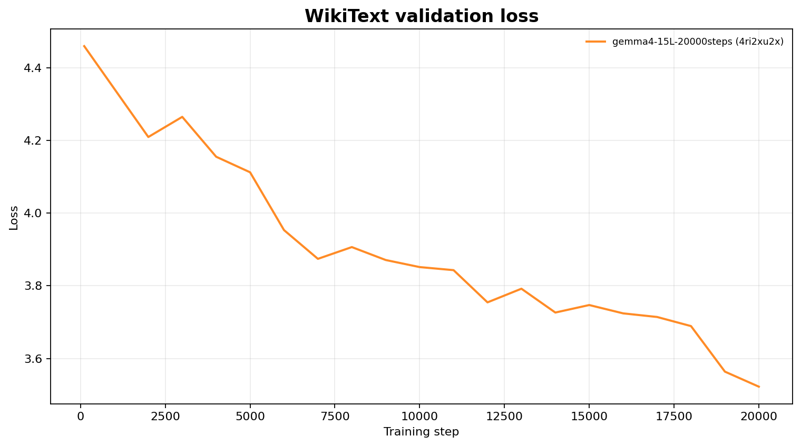
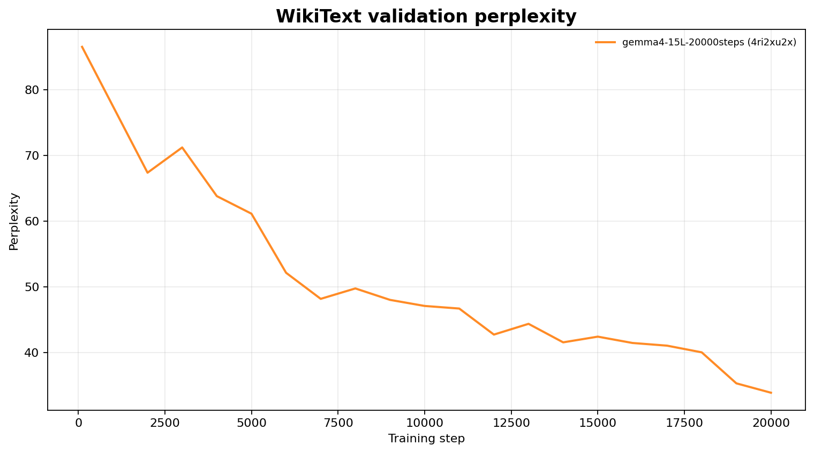
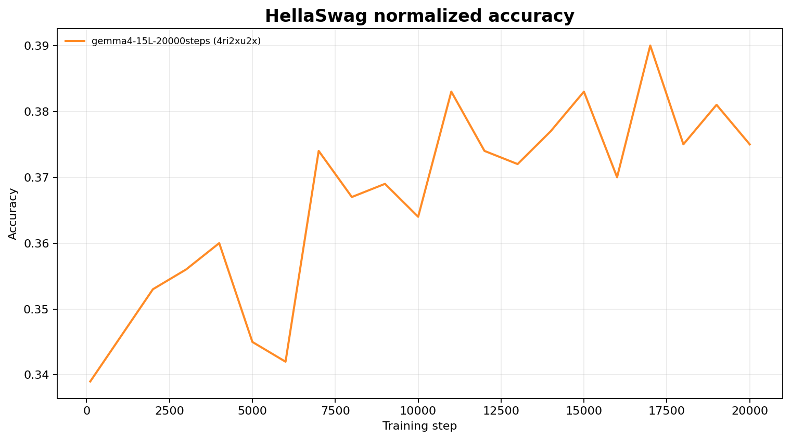

# GemmaCustom — a ~0.95 B text-only Gemma‑4 pretrained from scratch on Nemotron‑CC‑v2

This repo takes Google's **`google/gemma-4-E2B`** checkpoint (a ~5 B multimodal
model), performs **architectural surgery** to shrink it to a **~0.95 B
text‑only decoder**, warm‑starts the small model from the surviving E2B weights,
and **pretrains** it on the gated **`nvidia/Nemotron-CC-v2`** corpus with the
Hugging Face `Trainer`.

Everything lives in one script: [`train_nvidia_cc.py`](train_nvidia_cc.py).

---

## 1. The surgery: 5 B multimodal → 0.95 B text‑only

`google/gemma-4-E2B` ships as `Gemma4ForConditionalGeneration` with three towers
(text / vision / audio) and the Gemma‑3n‑style *Per‑Layer Embedding* (PLE)
mechanism. The bulk of its parameters are **not** in the transformer stack:

| Component (E2B)                         | Shape / size            | Params    | Kept? |
| -------------------------------------- | ----------------------- | --------- | ----- |
| `model.language_model.embed_tokens`    | `262144 × 1536`         | 0.40 B    | ✅ kept |
| `model.language_model.embed_tokens_per_layer` (PLE table) | `262144 × 8960` | **2.35 B** | ❌ dropped |
| PLE plumbing (`per_layer_*` projections, gates, norms) | —          | ~0.05 B   | ❌ dropped |
| 35 transformer layers                  | `hidden=1536`, MLP `6144`| 1.85 B    | ✂️ first **15** kept |
| Vision encoder (`gemma4_vision`, 16 L) | `hidden=768`            | ~0.30 B   | ❌ dropped |
| Audio encoder (`gemma4_audio`, 12 L)   | `hidden=1024`           | ~0.18 B   | ❌ dropped |

### What `build_config()` changes

The custom model is declared as a plain **`gemma4_text`** config (see
`build_config()` in `train_nvidia_cc.py`):

| Knob                          | E2B (`text_config`) | This model | Effect |
| ----------------------------- | ------------------- | ---------- | ------ |
| `num_hidden_layers`           | **35**              | **15**     | drop the deepest 20 blocks (`NUM_LAYERS`) |
| `hidden_size_per_layer_input` | **256**             | **0**      | **disable PLE** → removes the 262 144 × 8960 per‑layer embedding table and all `per_layer_*` weights |
| `num_kv_shared_layers`        | **20**              | **0**      | no cross‑layer KV sharing; every layer owns its K/V projection |
| `max_position_embeddings`     | 131 072             | 8 192      | shorter RoPE range (`max(CONTEXT_LEN, 8192)`) |
| `final_logit_softcapping`     | 30.0                | `null`     | no logit soft‑cap |
| vision / audio configs        | present             | **absent** | text‑only `Gemma4ForCausalLM` |

### What is **preserved** unchanged from Gemma‑4

- **Tokenizer & vocab** — `google/gemma-4-E2B` tokenizer, `vocab_size = 262144`,
  **tied** input/output embeddings (no separate `lm_head`).
- **Width** — `hidden_size = 1536`, `intermediate_size = 6144`, GeGLU MLP
  (`gelu_pytorch_tanh`).
- **Attention** — 8 query heads, **1 KV head** (multi‑query / GQA), `head_dim = 256`
  on sliding layers and **`head_dim = 512` on the full‑attention layers** (Gemma‑4's
  `global_head_dim`, auto‑derived into `per_layer_config` for layers 4/9/14).
- **Layer schedule** — every 5th layer is `full_attention`, the rest are
  `sliding_attention` with a **512‑token window**
  (`"full_attention" if (i+1) % 5 == 0 else "sliding_attention"`), so layers
  **5, 10, 15** are global.
- **RoPE** — `rope_theta = 1e6` (proportional, `partial_rotary_factor = 0.25`) on
  full layers, `rope_theta = 1e4` on sliding layers.
- **Norms** — RMSNorm (`eps = 1e-6`), Gemma's pre/post attention & pre/post
  feed‑forward norms, plus per‑head `q_norm` / `k_norm` and the per‑layer
  `layer_scalar`.

### Resulting parameter budget (`~0.955 B`)

```
embed_tokens (tied)                ~402.7 M
15 transformer blocks              ~552.1 M   (13 sliding @ ~35.4 M + 2 full-attn @ ~42.5 M
                                               + per-head norms / layer_scalar)
final norm                            ~0.002 M
------------------------------------------------
total                               954.8 M   ≈ 0.95 B
```

Measured: **`954,831,375`** parameters in
`checkpoints-fineweb/checkpoint-*/model.safetensors` (212 tensors, no `lm_head`
tensor — embeddings are tied).

### Warm‑start (`WARM_START = True`)

`warm_start_from_e2b()` streams `model.safetensors` from `google/gemma-4-E2B` and
copies **only** tensors that:

1. contain `"language_model"` in their name (the text tower),
2. map onto an existing key after stripping the `model.language_model.` prefix, **and**
3. match the destination tensor's shape exactly.

For a 15‑layer model that means the token embedding, the final norm, and **all
weights of layers 0–14** transfer verbatim; PLE tensors and layers 15–34 are
simply skipped. Loading is `strict=False`, then `tie_weights()` re‑ties the
embedding to the output projection. The remaining ~1 % of tensors (anything
without a shape/name match) keep their fresh init.

> The model is therefore **not trained from random init** — it starts from a
> genuine Gemma‑4 language model that has merely been made shallower and stripped
> of its multimodal / PLE machinery, then continues pretraining to adapt to the
> new (PLE‑free, 15‑layer) shape.

---

## 2. Pretraining

### Data — `nvidia/Nemotron-CC-v2`

- **Config:** `High-Quality` (`DATASET_CONFIG`; other options in the source:
  `High-Quality-Synthetic`, `Medium-High-Quality`, `Medium-Quality`,
  `Diverse-QA`, `Translated-Diverse-QA`).
- **Gated** — needs an `HF_TOKEN` with access to the dataset (read from `.env`).
- Loaded **streaming** (`load_dataset(..., streaming=True)`).
- The **first `VAL_DOCS = 2000` documents** are reserved for the held‑out eval
  and `.skip()`‑ped from the training stream, so train / val are disjoint.
- `.shuffle(seed=1234, buffer_size=100)` — a deliberately small buffer
  (prefilled into RAM before the first batch).
- **Tokenize:** one BOS per document, each doc truncated to `2 × CONTEXT_LEN`
  before packing.
- **Pack:** concatenate token streams and cut into **non‑overlapping 2048‑token
  blocks**; `labels = input_ids` (full‑block causal‑LM loss, no masking).
- `map()` runs in tiny `batch_size = 128` chunks to keep the packing buffers off
  the host RAM.

### Model / sequence

| Setting        | Value                          |
| -------------- | ------------------------------ |
| `CONTEXT_LEN`  | **2048** tokens                |
| precision      | **bf16** (`bf16=True`)         |
| grad checkpoint| on, non‑reentrant (`use_cache=False`) |
| seed           | 1234                           |

### Optimization

| Setting                          | Value |
| -------------------------------- | ----- |
| `per_device_train_batch_size`    | 8 |
| `gradient_accumulation_steps`    | 4 |
| effective batch                  | 8 × 4 × 2048 = **65,536 tokens / optimizer step** (single GPU) |
| `max_steps`                      | **20,000**  → ≈ **1.3 B tokens** total |
| optimizer                        | AdamW, β = (0.9, 0.95), `weight_decay = 0.1` |
| grad clip                        | `max_grad_norm = 1.0` |
| peak LR                          | **3e‑4** |
| LR schedule                      | **WSD** (`warmup_stable_decay`) |
| &nbsp;&nbsp;• warmup             | 500 steps (linear 0 → peak) |
| &nbsp;&nbsp;• stable             | 16,500 steps (hold at peak) |
| &nbsp;&nbsp;• decay              | final **3,000** steps, cosine to `0.1 × peak` = 3e‑5 |
| checkpoints                      | every 250 steps, keep last 3 (`save_total_limit=3`) |
| logging                          | every 10 steps |
| dataloader workers               | 0 (>0 duplicates the whole stream per worker) |

> **Note:** the inline comment near `GRAD_ACCUM` still reads `8*16*2048 = 262k
> tokens/step` from an earlier configuration. The live values are
> `GRAD_ACCUM = 4` → **65,536 tokens/step**, and `run_hparams`
> (`effective_tokens_per_step`) logs that figure to W&B.

### In‑loop evaluation — `BenchmarkCallback`

Every `EVAL_STEPS = 1000` optimizer steps, on rank 0, blocking:

1. **WikiText‑2‑raw** (`Salesforce/wikitext`, validation) — packed 2048‑token
   blocks, up to 200 seqs → loss + perplexity.
2. **Nemotron‑CC‑v2 held‑out** — the 2000 skipped docs, same packing → loss +
   perplexity (a true in‑distribution val signal).
3. **HellaSwag** (`Rowan/hellaswag`, first 1000 of 10,042 val examples) —
   length‑normalised log‑likelihood scoring → `acc` and `acc_norm`.

`TokensSeenCallback` injects `train/tokens_seen` (derived cheaply from
`global_step × effective_batch × seq_len`) into every log record, slotted just
ahead of the W&B callback.

### Logging & resume — Weights & Biases

- Project: **`pretrain-gemma-4-0.95b`**, run name `gemma4-15L-20000steps`.
- One **resumable** run per `OUTPUT_DIR`: the run id is generated once and
  persisted to `checkpoints-fineweb/wandb_run_id.txt` (HF `Trainer` checkpoints
  don't carry custom keys), then reused with `resume="must"` on `--resume`.
- `wandb.init()` is called **before** the `Trainer` so its built‑in
  `WandbCallback` adopts the existing run instead of starting a new one.

---

## 3. Training curves

Metrics logged to Weights & Biases for the `gemma4-15L-20000steps` run. Training
signals are logged every 10 steps; the WikiText‑2 / HellaSwag eval points are
produced every `EVAL_STEPS = 1000` optimizer steps by `BenchmarkCallback`.

### Optimization

| Training loss | Learning rate (WSD) | Gradient norm |
| ------------- | ------------------- | ------------- |
|  |  |  |

- **Training loss** — full‑block causal‑LM loss on packed 2048‑token
  Nemotron‑CC‑v2 blocks.
- **Learning rate** — 500‑step linear warmup to the 3e‑4 peak, held stable, then
  cosine‑decayed to 3e‑5 over the final 3,000 steps.
- **Gradient norm** — pre‑clip global grad norm (`max_grad_norm = 1.0`).

### Held‑out evaluation

| WikiText‑2 loss | WikiText‑2 perplexity | HellaSwag accuracy |
| --------------- | --------------------- | ------------------ |
|  |  |  |

- **WikiText‑2‑raw** (`Salesforce/wikitext`, validation) — packed 2048‑token
  blocks, up to 200 sequences → loss and perplexity.
- **HellaSwag** (`Rowan/hellaswag`, first 1000 val examples) — length‑normalised
  log‑likelihood scoring (`acc` / `acc_norm`).

---

## 4. Running it

### Prerequisites

- A GPU with enough memory for a 0.95 B model in bf16 + Adam states + grad
  checkpointing (~24 GB is comfortable; set `bf16=False` only for CPU smoke tests).
- `.env` (in the repo root or CWD) with:
  ```
  HF_TOKEN=hf_...        # must have access to google/gemma-4-E2B and nvidia/Nemotron-CC-v2
  WANDB_API_KEY=...       # optional; omit / set WANDB_MODE=offline to skip cloud logging
  ```
- Python deps: `torch`, `transformers` (5.16+; this repo was run on 5.16.1),
  `datasets`, `wandb`, `python-dotenv`, `huggingface_hub`, `safetensors`.

### Commands

```bash
# fresh run — surgery + warm-start + pretrain
python train_nvidia_cc.py

# resume from the latest checkpoint in ./checkpoints-fineweb
python train_nvidia_cc.py --resume
```

On resume, `ignore_data_skip=True` means the streaming loader does **not** replay
consumed batches — training continues from a fresh position in the shuffled
stream, which is the intended behaviour for an effectively infinite corpus.

### Output

- `./checkpoints-fineweb/checkpoint-<step>/` — periodic `Trainer` checkpoints
  (`model.safetensors`, optimizer, scheduler, RNG, `trainer_state.json`).
- `./checkpoints-fineweb/` — final `save_model()` + tokenizer at the end of
  training.
- `./checkpoints-fineweb/wandb_run_id.txt` — the persistent W&B run id.

### Current state of this checkout

`checkpoints-fineweb/` contains checkpoints up to **step 1250 / 20000**
(`epoch ≈ 0.037`, train loss ≈ 3.66), i.e. an early‑stage run in progress.

---

## 5. Architecture summary

```
Gemma4ForCausalLM (model_type = "gemma4_text")
├─ embed_tokens               262144 × 1536   (tied to output)
├─ 15 × Gemma4DecoderLayer
│   ├─ input_layernorm (RMSNorm)
│   ├─ self_attn        8 Q heads · 1 KV head (MQA)
│   │   ├─ sliding layers  head_dim 256, window 512, rope_theta 1e4
│   │   └─ full  layers    head_dim 512,   global,   rope_theta 1e6   (layers 5,10,15)
│   │   └─ q_norm / k_norm (per-head RMSNorm)
│   ├─ post_attention_layernorm
│   ├─ pre_feedforward_layernorm
│   ├─ mlp               GeGLU, 1536 → 6144 → 1536, gelu_pytorch_tanh
│   ├─ post_feedforward_layernorm
│   └─ layer_scalar
└─ norm (RMSNorm)

vocab 262144 · hidden 1536 · MLP 6144 · 15 layers · ~0.955 B params · ctx 2048 (train) / 8192 (rope)
NO Per-Layer Embeddings · NO KV sharing · NO vision/audio towers · NO separate lm_head
```
